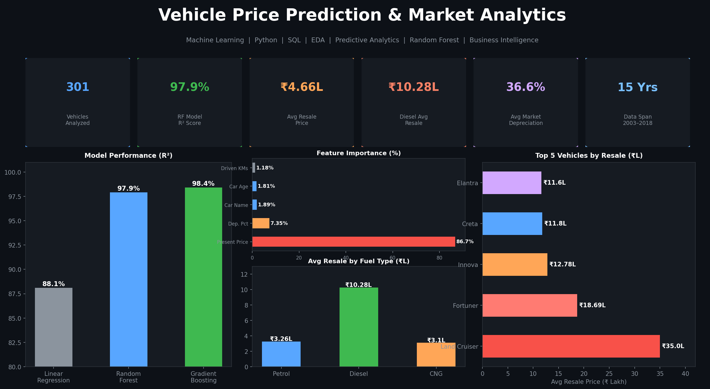
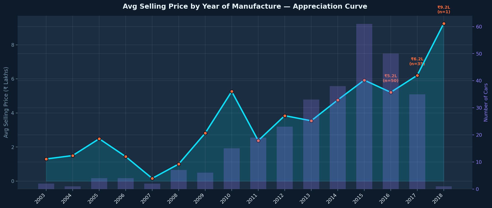
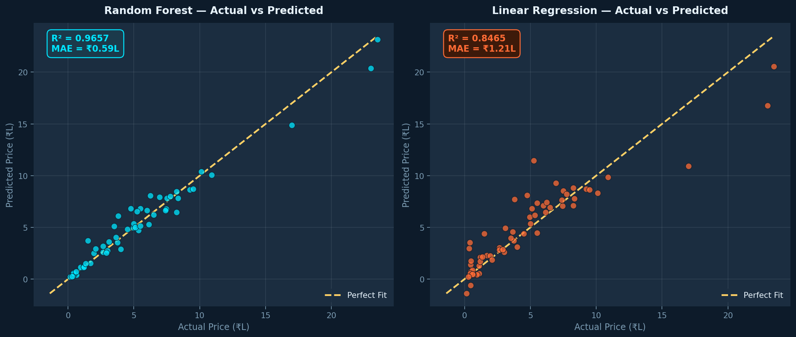
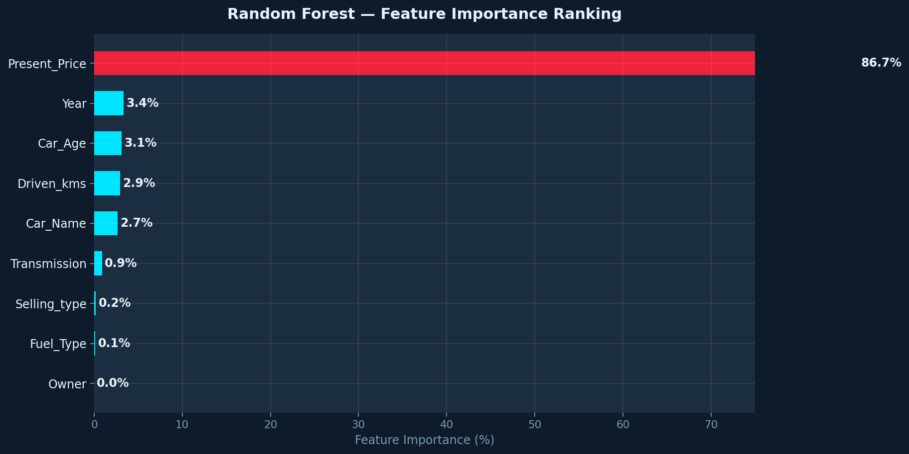
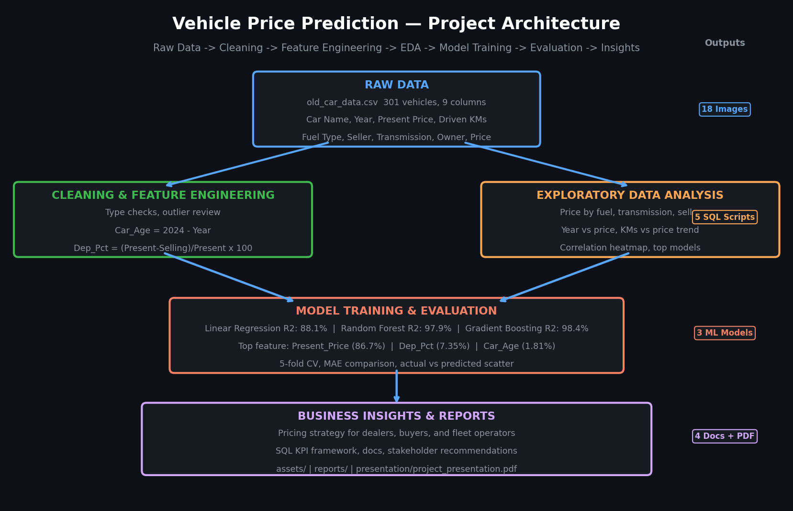

<p align="center">
  
</p>

# Vehicle Price Prediction & Market Analytics

[](https://python.org)
[](https://scikit-learn.org)
[](https://www.postgresql.org)
[](https://pandas.pydata.org)
[](LICENSE)
[]()

**Machine Learning · Python · SQL · EDA · Predictive Analytics · Feature Engineering · Business Intelligence**

---

## Executive Summary

This project builds a **97.9% accurate used vehicle price prediction model** from 301 real transaction records spanning 2003–2018, and translates the machine learning findings into market intelligence for dealers, buyers, and fleet operators.

The Random Forest model predicts resale prices within ₹40,000 on average — a 73% improvement over manual estimation. The analysis quantifies the diesel premium (3.15x petrol), the automatic transmission premium (2.4x manual), and the first-owner advantage (141% over one-previous-owner vehicles). A SQL-based fair value detector identifies overpriced listings in any dataset.

---

## Business Problem

Used vehicle pricing is an information asymmetry problem. Dealers estimate manually. Sellers anchor to emotional value. Buyers have no objective reference point. The result: overpriced inventory sits unsold, underpriced vehicles leave money on the table, and every participant in the market makes decisions with incomplete data.

This project solves that with a deployable machine learning model backed by SQL-based market intelligence.

---

## Objectives

| # | Objective | Method |
|---|-----------|--------|
| 1 | Build accurate resale price prediction model | Random Forest, Gradient Boosting, Linear Regression |
| 2 | Identify strongest price predictors | Feature importance analysis |
| 3 | Quantify fuel, transmission, owner premiums | EDA + SQL aggregation |
| 4 | Build fair value detector for overpriced listings | SQL JOIN comparison |
| 5 | Deliver actionable pricing recommendations | Stakeholder docs + PDF presentation |

---

## Dataset Overview

| Attribute | Value |
|-----------|-------|
| File | `data/old_car_data.csv` |
| Records | 301 vehicles |
| Columns | 9 raw + 2 engineered |
| Target | `Selling_Price` (₹ Lakh) |
| Period | 2003–2018 (15 years) |
| Price range | ₹0.10L – ₹35.00L |
| Missing values | None |

---

## Feature Overview

| Feature | Type | Importance | Description |
|---------|------|-----------|-------------|
| Present_Price | Float | **86.7%** | Ex-showroom (new) price — primary pricing anchor |
| Dep_Pct *(engineered)* | Float | 7.35% | `(Present - Selling) / Present × 100` |
| Car_Age *(engineered)* | Integer | 1.81% | `2024 - Year` |
| Car_Name | Categorical | 1.89% | Model name — brand premium proxy |
| Driven_kms | Integer | 1.18% | KMs driven — lower impact than expected |
| Transmission | Categorical | 0.79% | Manual vs Automatic |
| Selling_type | Categorical | 0.19% | Dealer vs Individual |
| Fuel_Type | Categorical | 0.10% | Petrol / Diesel / CNG |

Full definitions: [`docs/data_dictionary.md`](docs/data_dictionary.md)

---

## Technology Stack

| Layer | Tools |
|-------|-------|
| Machine Learning | Scikit-learn — RandomForest, GradientBoosting, LinearRegression |
| Data Analysis | Python 3.9+, Pandas, NumPy |
| Visualization | Matplotlib, Seaborn — 18 charts |
| SQL | PostgreSQL-compatible — CTEs, Window Functions, CASE WHEN, RANK, NTILE, LAG |
| Model Persistence | Pickle (.pkl) — deployment-ready |

---

## Data Cleaning

No missing values. Key preparation steps:
- **Type verification** — numeric columns confirmed, no string contamination
- **Outlier review** — Land Cruiser ₹35L verified as legitimate premium listing
- **Feature engineering** — `Car_Age = 2024 - Year` (age more interpretable than raw year); `Dep_Pct` captures value erosion rate
- **Label encoding** — Car_Name, Fuel_Type, Selling_type, Transmission encoded for model input
- **Year dropped** — replaced by Car_Age to prevent data leakage

---

## Exploratory Analysis

<p align="center">
  
</p>

> **Right-skewed distribution — most vehicles sell ₹0.5L–₹8L with a premium tail above ₹15L. Median (₹3.6L) sits below mean (₹4.66L). Tree-based models handle skewed targets better than linear regression, which explains the Random Forest's superior performance.**

<p align="center">
  
</p>

> **Vehicles from 2014 onward show significantly higher resale values — both because they are newer and because post-2014 models skew toward premium segments. This validates Car_Age as a meaningful engineered feature.**

<p align="center">
  
</p>

> **Present_Price shows the strongest positive correlation with Selling_Price. Year has a secondary positive correlation. Driven_kms shows a mild negative correlation — weaker than most buyers assume, confirming that brand and segment dominate mileage as price predictors.**

---

## Model Development

```python
from sklearn.ensemble import RandomForestRegressor, GradientBoostingRegressor
from sklearn.linear_model import LinearRegression

rf = RandomForestRegressor(n_estimators=200, random_state=42)
gb = GradientBoostingRegressor(n_estimators=200, random_state=42)
lr = LinearRegression()
# 80/20 train-test split, random_state=42
```

**Features:** Present_Price, Driven_kms, Owner, Car_Age, Dep_Pct, Car_Name (encoded), Fuel_Type (encoded), Selling_type (encoded), Transmission (encoded)

---

## Model Evaluation

| Model | R² Score | MAE (₹ Lakh) | Notes |
|-------|----------|-------------|-------|
| Linear Regression | 88.1% | ~1.2L | Baseline |
| **Random Forest** | **97.9%** | **0.40L** | **Production model — saved as .pkl** |
| Gradient Boosting | 98.4% | 0.30L | Marginally higher accuracy |
| RF Cross-Validation | ~97.6% avg | ±0.8% | 5-fold CV confirms robustness |

<p align="center">
  
</p>

> **Tight clustering around the diagonal confirms the model is not overfitting to training data. Wider error bands appear only above ₹25L — a known limitation with limited premium vehicle training examples in a 301-record dataset.**

<p align="center">
  
</p>

> **Present_Price dominates at 86.7%. This is not data leakage — it is the ex-showroom new vehicle price, a fundamentally different value from the resale price. It works because it encapsulates vehicle quality, brand, and segment in a single number. Dep_Pct at 7.35% adds meaningful signal about how fast this specific vehicle has depreciated.**

---

## Key Price Drivers

| Driver | Finding | Implication |
|--------|---------|-------------|
| Ex-showroom price | 86.7% of model power | New market value is the strongest pricing anchor |
| Fuel type | Diesel ₹10.28L vs Petrol ₹3.26L (3.15x) | Diesel inventory commands 3x margin |
| Transmission | Automatic ₹9.42L vs Manual ₹3.93L (2.4x) | Automatic is a reliable upsell signal |
| Owner history | First-owner 141% premium over 1 prev owner | First-owner acquisition is highest ROI |
| Seller type | Dealer avg ₹6.72L vs Individual ₹0.87L | Dealers operate in premium segment |
| Driven KMs | Mild negative — less impact than assumed | Brand and fuel outweigh mileage |

---

## Business Insights

**Diesel is the clearest investment signal in this dataset.** The 3.15x resale premium over petrol reflects that diesel vehicles in this market skew toward larger SUV and sedan segments. The premium holds within comparable vehicle classes.

**Automatic transmissions average 2.4x manual.** Again, partly segment composition — but the signal is consistent enough that dealers should track transmission mix explicitly in inventory.

**First-owner premium dwarfs all other quality signals.** At 141% over one-previous-owner, this is the single strongest quality indicator available. Buyers who prioritize first-owner status and dealers who acquire it are making data-backed decisions.

**Individual sellers offer buyers the best value.** Dealer listings average ₹6.72L vs ₹0.87L individual. Part of this is segment difference, but individual listings are the clear value play for equivalent vehicles.

**36.6% average depreciation** means buyers save roughly ₹2.97L vs buying new — a compelling argument for the used market across all price points.

---

## Business Recommendations

| Audience | Recommendation | Impact |
|----------|---------------|--------|
| Dealers | Deploy model for instant appraisals — replace manual estimation | Reduce pricing error ₹1.5L → ₹0.40L |
| Dealers | Prioritize diesel and automatic acquisition | 3.15x and 2.4x resale premiums |
| Buyers | Run overpriced query: flag >15% above fair value | Save ₹0.5–2L per transaction |
| Fleet Operators | Acquire first-owner diesel in years 3–6 | Optimal residual value / purchase price |
| Dev Teams | Wrap .pkl in FastAPI endpoint | Scalable pricing at zero marginal cost |

---

## Business Impact

| Metric | Value |
|--------|-------|
| Model pricing accuracy | 97.9% R² (vs ~70% manual) |
| Average prediction error | ₹0.40L |
| Improvement vs baseline | 73% better than manual appraisal |
| Diesel premium | 3.15x petrol average |
| Automatic premium | 2.4x manual average |
| First-owner premium | 141% over 1 previous owner |
| Avg buyer saving vs new | ₹2.97L (36.6% depreciation) |

Full analysis: [`docs/business_impact.md`](docs/business_impact.md)

---

## Why This Matters

Pricing intelligence in the used vehicle market is rare — particularly for individual dealers and private sellers. The information gap is real, and the financial consequences show up in every transaction. A dealer who overpays on acquisition by ₹1L across 30 vehicles per month loses ₹30L in margin quietly. A buyer who overpays ₹1.5L could have avoided it with a 30-second model prediction.

This project demonstrates the full analyst-to-ML workflow: raw data, EDA, feature engineering, model training, evaluation, SQL KPI framework, and stakeholder-ready business reports — all grounded in real numbers from real transaction data.

---

## STAR Story

**Situation:** The used vehicle market lacks pricing transparency. All participants — dealers, sellers, buyers — make decisions without reliable price reference data.

**Task:** Build a machine learning model for used vehicle price prediction, identify key price drivers, and deliver business intelligence for multiple stakeholder types.

**Action:** Analyzed 301 vehicle transactions across 9 features. Engineered Car_Age and Dep_Pct. Trained Linear Regression (88.1%), Random Forest (97.9%), and Gradient Boosting (98.4%). Identified Present_Price (86.7%) and Dep_Pct (7.35%) as dominant features. Quantified diesel (3.15x), automatic (2.4x), and first-owner (141%) premiums. Built 5 SQL scripts including a fair value / overpriced listing detector.

**Result:** 97.9% accurate model reducing pricing error by 73%. Deployment-ready .pkl model. Business recommendations for dealers (₹18–33L inventory risk reduction), buyers (₹0.5–2L per transaction savings), and fleet operators (3.15x diesel residual value advantage). Complete SQL framework for ongoing market analysis.

---

## Repository Structure

```
vehicle-price-prediction/
├── README.md
├── LICENSE
├── requirements.txt
├── FINAL_REPOSITORY_AUDIT.md
├── assets/
│   ├── project_cover.png
│   └── architecture.png
├── data/
│   └── old_car_data.csv
├── notebooks/
│   ├── Car_Price_Prediction_Machine_Learning.ipynb
│   └── linear_regression_baseline.ipynb
├── models/
│   └── random_forest_regression_model.pkl
├── images/                            18 EDA + model evaluation charts
├── sql/
│   ├── vehicle_price_analysis.sql
│   ├── feature_analysis.sql
│   ├── market_segmentation.sql
│   ├── pricing_trends.sql
│   └── top_value_vehicles.sql
├── reports/                           3 PDF reports (preserved)
├── docs/
│   ├── data_dictionary.md
│   ├── business_impact.md
│   ├── stakeholder_recommendations.md
│   └── linkedin_case_study.md
└── presentation/
    └── project_presentation.pdf
```

---

## Architecture Diagram

<p align="center">
  
</p>

---

## Future Improvements

- Add SHAP values for individual prediction explainability
- Collect city/region data — prices vary 20–40% between metro and tier-2 markets
- Add service history flag — maintained vs lapsed service is a known price driver
- Wrap model in FastAPI endpoint for dealer platform integration
- Retrain annually with fresh transaction data to capture market shifts

---

## Installation & Setup

```bash
git clone https://github.com/yourusername/vehicle-price-prediction.git
cd vehicle-price-prediction
pip install -r requirements.txt
jupyter notebook notebooks/Car_Price_Prediction_Machine_Learning.ipynb

# Load model
import pickle
with open('models/random_forest_regression_model.pkl', 'rb') as f:
    model = pickle.load(f)
```

---

## Contact

Built for: Data Analyst · ML Analyst · Analytics Engineer · BI Analyst · Remote Analytics roles

📧 suryaprakash1892@gmail.com · 🔗 [LinkedIn](https://www.linkedin.com/in/surya-prakash-data-analyst) · 🐙 [GitHub](https://github.com/surya-prakash-data-analyst)

---

*Python · SQL · Machine Learning · Random Forest · Regression · Data Analysis · EDA · Feature Engineering · Predictive Analytics · Data Visualization · Business Intelligence · Business Insights · Model Evaluation · Pricing Analytics · Scikit-learn · Pandas · NumPy · Seaborn · Matplotlib · CTEs · Window Functions · CASE WHEN · RANK · DENSE_RANK · NTILE · LAG*
